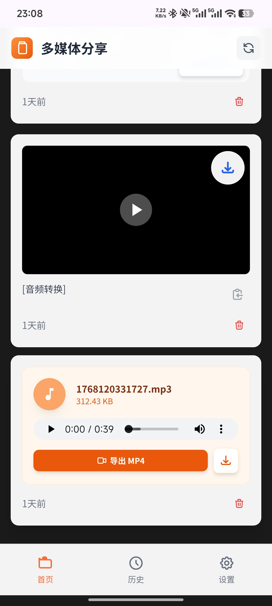
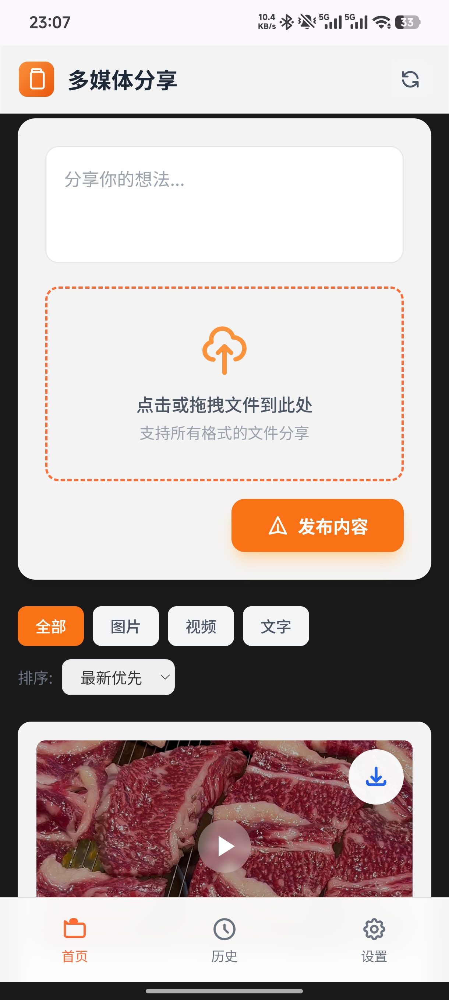
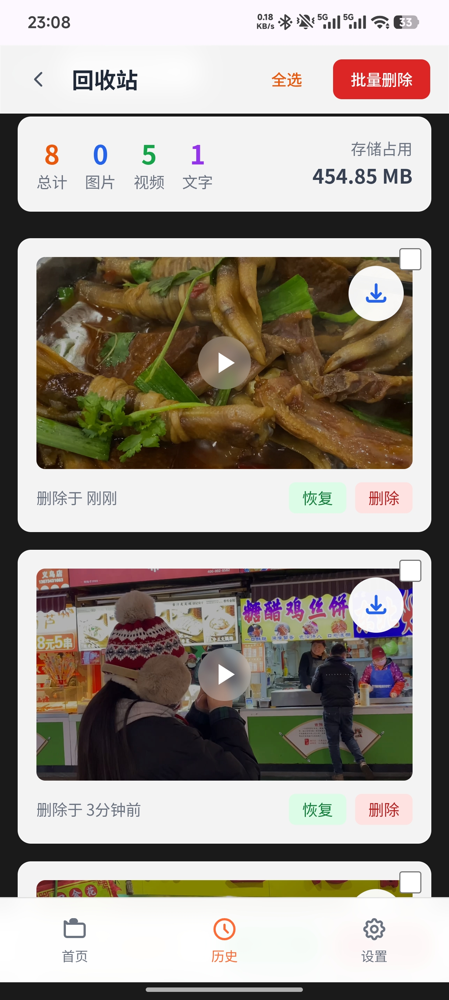
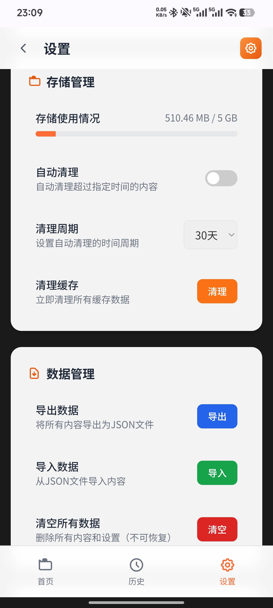

# 多媒体分享平台

一个支持多端分享的智能内容管理工具，基于Node.js + Express开发。

## 📸 界面预览

<table>
  <tr>
    <td width="50%">
      
      <p align="center"><b>首页 - 内容分享</b></p>
    </td>
    <td width="50%">
      
      <p align="center"><b>文件上传</b></p>
    </td>
  </tr>
  <tr>
    <td width="50%">
      
      <p align="center"><b>历史记录管理</b></p>
    </td>
    <td width="50%">
      
      <p align="center"><b>系统设置</b></p>
    </td>
  </tr>
</table>

## ✨ 特性

- 🖼️ **多媒体支持**: 支持图片、视频、音频和文字内容的分享
- 🎥 **视频预览**: 点击即可播放，支持 iOS/Android 跨平台兼容
- 🔄 **音视频转换**: 内置 FFmpeg，支持音频转视频、视频转码优化
- 🔄 **实时同步**: 多端实时同步，A端分享 B端可见
- 📱 **移动端优化**: 完美适配 iPhone/iPad/Android，解决底部导航遮挡问题
- 🗂️ **内容管理**: 支持内容筛选、排序、删除和恢复
- ⚙️ **灵活设置**: 自动刷新、深色模式、存储管理等
- 🚀 **高性能**: 基于 Node.js + Express，性能优异
- 🐳 **容器化部署**: 支持 Docker 容器化部署

## 🛠️ 技术栈

- **后端**: Node.js + Express
- **前端**: 原生 JavaScript + Tailwind CSS
- **媒体处理**: FFmpeg（音视频转换、编码优化）
- **存储**: 本地文件系统 + JSON 数据存储
- **部署**: Docker + Docker Compose + Nginx

## 🚀 快速开始

### 方法一：直接运行（推荐开发环境）

```bash
# 克隆项目（或下载源码）
git clone <repository-url>
cd media-share-platform

# 使用快速启动脚本
./quick-start.sh
```

或使用npm：

```bash
npm install
npm start
```

### 方法二：Docker部署（推荐生产环境）

```bash
# 使用Docker Compose启动
docker-compose up -d

# 查看日志
docker-compose logs -f

# 访问应用
# 方式1：通过 Nginx 访问（推荐）
http://localhost:8580

# 方式2：直接访问 Node.js 后端
http://localhost:3000
```

**端口说明**：
- `8580`：Nginx 反向代理端口（推荐使用，提供静态资源缓存和负载均衡）
- `3000`：Node.js 后端直接访问端口

**Docker Compose 服务架构**：
- **app 容器**：Node.js + Express 后端服务（内部端口 3000）
- **nginx 容器**：Nginx 反向代理（内部端口 80，映射到主机 8580）

如需修改端口，编辑 `docker-compose.yml` 文件中的 `ports` 配置。

### 方法三：手动部署

```bash
# 安装依赖（需要先安装 Node.js 和 FFmpeg）
npm install

# 创建必要目录
mkdir -p uploads data

# 启动服务（默认端口 3000）
node server.js

# 或指定自定义端口
PORT=8080 node server.js
```

访问地址：`http://localhost:3000`

## 📁 项目结构

```
media-share-platform/
├── server.js              # Node.js后端服务
├── package.json           # 项目依赖配置
├── Dockerfile            # Docker镜像配置
├── docker-compose.yml    # Docker Compose配置
├── nginx.conf            # Nginx配置文件
├── quick-start.sh        # 快速启动脚本
├── public/               # 前端静态文件
│   ├── index.html        # 首页
│   ├── history.html      # 历史页面
│   ├── settings.html     # 设置页面
│   └── main.js           # 前端JavaScript
├── uploads/              # 上传文件存储目录
├── data/                 # 数据文件存储目录
└── README.md             # 项目文档
```

## 🔧 配置说明

### 环境变量

| 变量名 | 默认值 | 说明 |
|--------|--------|------|
| PORT | 3000 | 服务端口 |
| NODE_ENV | production | 运行环境 |

### 文件上传配置

- **最大文件大小**: 500MB
- **支持格式**: 所有格式文件（图片、视频、音频、PDF、ZIP 等）
- **特殊功能**: 
  - 音频文件可一键转为 MP4 视频
  - 视频文件可转码为 H.264/AAC 兼容格式（iOS/Android 通用）

### 数据存储

- **内容数据**: `data/contents.json`
- **删除数据**: `data/deleted.json`
- **上传文件**: `uploads/` 目录

## 🌐 API接口

### 获取所有内容
```http
GET /api/contents
```

### 获取已删除内容
```http
GET /api/deleted
```

### 创建内容（带文件上传）
```http
POST /api/contents
Content-Type: multipart/form-data
```

### 删除内容
```http
DELETE /api/contents/:id
```

### 恢复内容
```http
POST /api/contents/:id/restore
```

### 永久删除内容
```http
DELETE /api/contents/:id/permanent
```

### 视频转码优化
```http
POST /api/video/optimize
```

### 批量操作
```http
POST /api/batch/restore
DELETE /api/batch/permanent
```

### 健康检查
```http
GET /api/health
```

## 📱 页面说明

- **首页** (`/`): 内容展示、发布新内容
- **历史页面** (`/history.html`): 已删除内容管理
- **设置页面** (`/settings.html`): 应用设置和数据管理

## 🎨 界面特性

- **现代化设计**: 采用毛玻璃效果和圆角设计
- **响应式布局**: 完美适配各种屏幕尺寸
- **移动端优化**: 针对 iOS/Android 浏览器特别优化
  - 视频封面自动显示（iOS Safari 兼容）
  - 解决底部导航遮挡问题
  - 复制功能兼容非 HTTPS 环境
- **用户友好**: 直观的操作界面和提示信息

## 🎮 功能详解

### 内容发布
- 支持文字、图片、视频、音频及任意格式文件发布
- 支持多文件同时上传
- 拖拽上传功能
- 实时预览

### 内容管理
- 按类型筛选（全部/图片/视频/文字）
- 按时间排序（最新/最旧）
- 内容详情查看（视频可直接播放）
- 删除和恢复功能

### 音视频处理
- 音频转 MP4 视频（黑色背景 + 音频轨）
- 视频转码优化（H.264 + AAC，兼容 iOS 相册保存）
- 实时进度提示（加载动画）

### 批量操作
- 批量选择内容
- 批量恢复已删除内容
- 批量永久删除内容

### 系统设置
- 自动刷新配置
- 存储管理（自动清理）
- 深色模式切换
- 声音和震动反馈
- 数据导入导出

## 🚀 部署建议

### 开发环境
```bash
npm run dev  # 使用nodemon自动重启
```

### 生产环境
- 使用PM2等进程管理工具
- 配置Nginx反向代理
- 设置SSL证书
- 配置自动备份

### Docker部署（单容器）

如果只需要后端服务，不使用 Nginx：

```bash
# 构建镜像
docker build -t media-share-platform .

# 运行容器
docker run -d -p 3000:3000 --name media-share media-share-platform

# 访问应用
http://localhost:3000
```

### Docker Compose 部署（完整架构）

推荐使用 Docker Compose 部署完整的 Nginx + Node.js 架构：

```bash
# 启动服务
docker-compose up -d

# 停止服务
docker-compose down

# 重新构建并启动
docker-compose up -d --build --force-recreate

# 访问应用
http://localhost:8580  # 通过 Nginx（推荐）
http://localhost:3000  # 直接访问后端
```

**ARM 平台部署**：如果在 ARM 架构设备（如树莓派、Apple Silicon Mac）上部署，请使用专用部署脚本：

```bash
# 给部署脚本授权
chmod +x arm-deploy.sh

# 运行 ARM 部署
./arm-deploy.sh
```

**ARM 平台注意事项：**
- FFmpeg 在 ARM 平台上可能运行较慢，音视频转换时间会更长
- Docker 镜像构建可能需要更多时间
- 建议设备至少有 2GB RAM

## 📊 性能优化

- **媒体处理**: 基于 FFmpeg 的视频转码优化
- **缓存策略**: 合理的缓存配置
- **懒加载**: 视频预加载 metadata 优化

## 🔒 安全特性

- **文件类型验证**: 支持所有格式，无限制
- **文件大小限制**: 防止大文件攻击（500MB 上限）
- **CORS 配置**: 合理的跨域配置

## 🐛 故障排除

### 常见问题

1. **端口占用**
   ```bash
   # 查看端口占用
   lsof -i :3000     # Linux/Mac
   netstat -ano | findstr :3000  # Windows
   
   # 手动部署：使用其他端口
   PORT=3001 node server.js
   
   # Docker Compose：修改 docker-compose.yml 中的端口映射
   # 例如将 "8580:80" 改为 "8888:80"
   ```

2. **权限问题**
   ```bash
   # 确保有写入权限
   chmod -R 755 uploads data
   ```

3. **依赖安装失败**
   ```bash
   # 清除缓存后重试
   npm cache clean --force
   npm install
   ```

## 🤝 贡献

欢迎提交Issue和Pull Request！

## 📄 许可证

MIT License

## 🔗 相关链接

- [Node.js](https://nodejs.org/)
- [Express](https://expressjs.com/)
- [Tailwind CSS](https://tailwindcss.com/)
- [Docker](https://www.docker.com/)

---

**注意**: 本项目仅供学习和个人使用，生产环境使用前请进行充分测试和安全加固。
